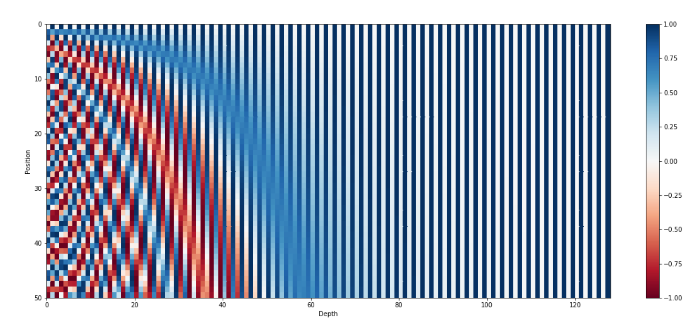

# Transformer From Scratch:

## Positional Encoding:

- We will require the position embedding to be unique for each word in the sentence. As it represents different position and having the same position will affect the learning of the model. Hence, we will need to create a bits and bytes type of representation for each word in the sentence. The LSB bit is alternating on every number, the second-lowest bit is rotating on every two numbers, and so on. However, using binary values would be inefficient in a world dominated by floating-point numbers. Instead, we can represent them with their continuous float equivalents—sinusoidal functions. These functions essentially act like alternating bits.

<em>Figure 2 - The 128-dimensional positonal encoding for a sentence with the maximum lenght of 50. Each row represents the embedding vector</em>

<!-- please write about this image also -->

### Some open Questions:
1. Is it somehow related to Fourier series and sin and cos defined on the circle. 
2. Why are we using 10000 as the base for the power of the sinusoidal function?
3. Why are we using the power of 2*i/d_model?
4. Is there any better positional encoding method? How much does this positional encoding affect the model?

## Acknowledgements:

* [Transformer Architecture: The Positional Encoding by Amirhossein Kazemnejad's](https://kazemnejad.com/blog/transformer_architecture_positional_encoding/)