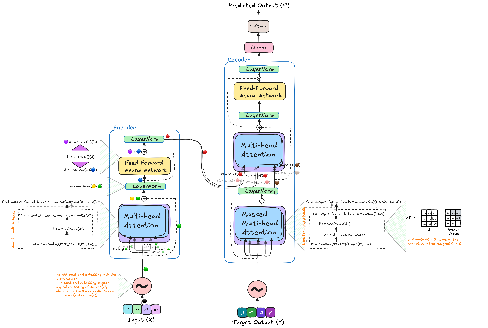
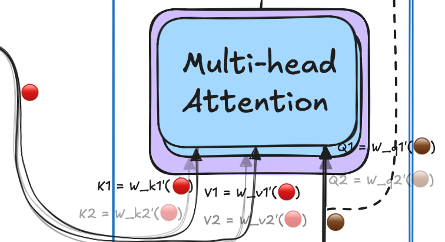

# 🤖🗒️ Transformer From Scratch

<p align="center"><Big><b>Hit the star 🌟 if you like the repo 😄</Big></b></p>
<p align="center">.</p>


The implementation is built by taking the [official reserch paper](https://arxiv.org/abs/1706.03762) as basis. This repo will be aimed to provide insights to me and to other how really Transformers work, even at gradients level. This repository aimed to implementing a 1-layer Transformer architecure with with no dropouts, custom optimisation and layers. This will not only enable the users to build upon this repo but will also be able to do toy experiments; as we all are GPU poor 😛. This light architecture can be easily understood and used by the community to inquire more about how tranformers learn and generalize? Furthermore, different experiments such as grokking for very simple experiments like prediting addition or other operation on numbers. This could also be used by others better understand Transformer.



<p align="center"><u>[Use Big-Screen for better view]</u></p>

*If you have any question or you would like me to add something, then please feel free to create an issue.*

## 📑 Table of Contents

- [🤖🗒️ Transformer From Scratch](#️-transformer-from-scratch)
  - [📑 Table of Contents](#-table-of-contents)
  - [🧿 Positional Encoding](#-positional-encoding)
  - [🍀🎃 Encoder](#-encoder)
    - [🐷 Multi-Head Attention](#-multi-head-attention)
    - [🤥 LayerNorm](#-layernorm)
    - [🥳 Feed-Forward Layers:](#-feed-forward-layers)
  - [🐳🐙 Decoder](#-decoder)
    - [🐸 Masked Multi-Head Attention](#-masked-multi-head-attention)
    - [🦃 Multi-Head Attention](#-multi-head-attention-1)
  - [🍾👨‍🎓 Exercise to understand Architecture in Depth.](#-exercise-to-understand-architecture-in-depth)
  - [🎀🙇🏻 Acknowledgements:](#-acknowledgements)
  - [Connect with me 😀 ](#connect-with-me--)

## 🧿 Positional Encoding

- We will require the position embedding to be unique for each word in the sentence. As it represents different position and having the same position will affect the learning of the model. Hence, we will need to create a bits and bytes type of representation for each word in the sentence. The LSB bit is alternating on every number, the second-lowest bit is rotating on every two numbers, and so on. However, using binary values would be inefficient in a world dominated by floating-point numbers. Instead, we can represent them with their continuous float equivalents—sinusoidal functions. These functions essentially act like alternating bits.

```python
    def position_embedding(self, sent: Tensor, d_model: int) -> Tensor:

        pe = np.zeros((sent.size()[0], d_model))

        for pos, word in enumerate(sent.size()[0]):
            for i in range(0,d_model, 2):
                pe[pos][i] = math.sin(pos/(10000**(2*i/d_model)))
                pe[pos][i+1] = math.cos(pos/(10000**(2*i/d_model)))

        # adding positional encoding to the sentence, that will be passed into the transformer (encoder/decoder).
        final_sent = sent + pe
        return t.tensor(final_sent)

```


<p align="center"><em>Figure 1 - The 128-dimensional positonal encoding for a sentence with the maximum lenght of 50. Each row represents the embedding vector [<a href = "https://kazemnejad.com/blog/transformer_architecture_positional_encoding/">1</a>].</em></p>

<!-- please write about this image also -->

<!-- ### 🙋🏻‍♂️ Open Questions:

1. Is there any better positional encoding method?
2. How much does this positional encoding affect the model and overall generalization? -->


## 🍀🎃 Encoder

* How can we think about the relevance of "key", "value," and "query"?
  - The "query" can be seen as the question being asked, while the "keys" represent the context or references used to determine how closely the query matches. The "values" hold the actual information or answers, and the most relevant value is selected based on the similarity between the query and the keys.


The other components of the encoder are explained in detail below, especially:

1. Multi-Head Attention
2. LayerNorm
3. Feed-Forward Layers


### 🐷 Multi-Head Attention

Multiple matrices, such as `W_q`, `W_k`, and `W_v`, are used to extract content from the input embeddings, transforming them into *queries*, *keys*, and *values*. The use of multiple heads allows the model to capture different aspects of the context for each query. This can be likened to a student having the ability to ask several questions (multiple heads) versus only being allowed to ask a single question (one head), thus enabling a richer understanding. 

All heads outputs are finally concatenated and filtered through a linear layer, which projects it into the dimension equivalent to a single head.  


```python
   def self_attention(self):

        query = self.W_q(self.input_embedding).view(1, self.num_heads, self.seq_len, self.q_dim) # (1, 2, 4, 512)
        key = self.W_k(self.input_embedding).view(1, self.num_heads, self.seq_len, self.k_dim) # (1, 2, 4, 512)
        value = self.W_v(self.input_embedding).view(1, self.num_heads, self.seq_len, self.v_dim) # (1, 2, 4, 512)
        
        # we will take the dot product of query and key to get the similarity score.
        attention_score = t.softmax(t.matmul(query, key.transpose(2,3))/t.sqrt(t.tensor(self.k_dim)), dim=-1) # (1, 2, 4, 4)
        overall_attention = t.matmul(attention_score, value)

        overall_attention = t.cat(overall_attention).view(1, self.seq_len, self.k_dim*self.num_heads) # (1, 4, 512)
        
        final_attention = self.W_o(overall_attention) # (1, 4, 512)
                
        return final_attention

```

### 🤥 LayerNorm

Layer normalization is a crucial technique used in transformers that helps stabilize and accelerate the training process, which normalizes the inputs to each layer, ensuring that they have a mean of zero and a standard deviation of one. This helps to stabilize the distribution of activations during training, which can lead to more consistent learning. As a result, producing the following effects on the network learning:
1. **Reduces Internal Covariate Shift:** By normalizing the inputs to each layer, layer normalization reduces the problem of internal covariate shift. This means that the distribution of inputs to each layer remains relatively constant throughout training, which helps improve convergence rates.
2. **Improves Gradient Flow:** By normalizing the inputs, layer normalization can mitigate issues with vanishing or exploding gradients. This is particularly important in deep networks like transformers, where gradient flow can be problematic.
3. **Faster Convergence:** With more stable training dynamics, models often converge faster, requiring fewer epochs to achieve similar performance levels compared to models without normalization.
4. **Independence from Batch Size:** Unlike batch normalization, which normalizes across a batch of inputs, layer normalization normalizes across the features for each individual sample. This makes it particularly well-suited for transformer architectures, where variable sequence lengths and batch sizes are common.
5. **Facilitates Training with Larger Learning Rates:** Layer normalization allows for the use of larger learning rates, which can further accelerate training and lead to better final performance.
6. **Enhances Generalization:** The normalization process can help the model generalize better to unseen data by reducing overfitting tendencies, as it adds a level of regularization.


<center><i>Figure 2: Layer Normalisation happens between same set of features of different samples [<a href = "https://www.pinecone.io/learn/batch-layer-normalization/">2</a>].</i></center>

```python
self.layer_norm = nn.LayerNorm(512)
```

### 🥳 Feed-Forward Layers:

The feed-forward layers module consist of 2 layers with a linear activation `ReLU` between them. 
The architecture of the module allows the former layer to project the output into a higher dimension, while the latter projects it into original space. 


```python
    def ffn(self, x:Tensor) -> Tensor:
        x1 = self.fc1(x)
        x2 = self.relu(x1)
        x3 = self.fc2(x2)
    
        return x3
```

---

This is the whole code of Encoder: 

```python
class encoder:

    def __init__(
        self,
        num_heads: int,
        sent: Tensor) -> None:
        
        super(encoder, self).__init__()
        
        self.sent = sent
        self.num_heads = num_heads
        self.k_dim = 512; self.v_dim = 512; self.q_dim = 512
        self.W_q = nn.Linear(512, self.k_dim*self.num_heads) 
        self.W_k = nn.Linear(512, self.k_dim*self.num_heads)
        self.W_v = nn.Linear(512, self.v_dim*self.num_heads)

        self.seq_len = sent.size()[0]
        assert self.seq_len == 4, "The sequence length should be 4."
        
        self.W_o = nn.Linear(512*self.num_heads,512) 
        
        self.layer_norm = nn.LayerNorm(512)
        
        self.fc1 = nn.Linear(512, 1024)
        self.fc2 = nn.Linear(1024, 512)
        self.relu = nn.ReLU()

    # we will make two heads for multi-head attention
    def self_attention(self):

        query = self.W_q(self.input_embedding).view(1, self.num_heads, self.seq_len, self.q_dim) # (1, 2, 4, 512)
        key = self.W_k(self.input_embedding).view(1, self.num_heads, self.seq_len, self.k_dim) # (1, 2, 4, 512)
        value = self.W_v(self.input_embedding).view(1, self.num_heads, self.seq_len, self.v_dim) # (1, 2, 4, 512)
        
        # we will take the dot product of query and key to get the similarity score.
        attention_score = t.softmax(t.matmul(query, key.transpose(2,3))/t.sqrt(t.tensor(self.k_dim)), dim=-1) # (1, 2, 4, 4)
        overall_attention = t.matmul(attention_score, value)

        overall_attention = t.cat(overall_attention).view(1, self.seq_len, self.k_dim*self.num_heads) # (1, 4, 512)
        
        final_attention = self.W_o(overall_attention) # (1, 4, 512)
                
        return final_attention
        

    def ffn(self, x:Tensor) -> Tensor:
        x1 = self.fc1(x)
        x2 = self.relu(x1)
        x3 = self.fc2(x2)
    
        return x3

    def forward(self):
        self.input_embedding = self.position_embedding(self.sent, 4)
        multi_head_attn = self.self_attention()
        multi_head_attn_out = self.W_o(multi_head_attn) #(4,2048) * (2048, 4) = (4, 4)
        input_embedding = self.layer_norm(multi_head_attn_out + self.input_embedding)
        ffn_out = self.ffn(input_embedding)
        encoder_out = self.layer_norm(ffn_out + input_embedding)
        return encoder_out
```


## 🐳🐙 Decoder

The decoder architecture is often one of the least explained aspects in related materials, with limited information available about how the decoder interacts with the encoder. Therefore, this section aims to provide a detailed explanation to clarify the decoder's role and operation. Certain components that are identical to the encoder, such as the Feed-Forward Network and Multi-Head Attention, are not covered in depth here.

The decoder takes the output or ground-truth sentence as input and adds positional embeddings before passing it through the masked multi-head attention module.


### 🐸 Masked Multi-Head Attention

In the masked multi-head attention module, the input is the sentence with added positional embeddings. The attention mechanism works similarly to the encoder, using "query," "key," and "value." However, the key difference is the inclusion of a masking tensor. This mask ensures that the model cannot access future token representations when predicting the next token, relying only on past information.

The masking tensor is constructed with values of $0$ and $-\infty$ for the upper right part of the matrix. This is added to the product of the query and key, keeping the lower left values (including the diagonal) intact while setting the upper right values to infinity. After applying softmax, these $-\infty$ elements are converted to $0$, effectively hiding future tokens for each word.
Finally, we incorporate the values, of the word with non-zero values by taking product between masked key-query product values `t.matmul(B1,V1)` as output of this module. Finally, similar to multi-head attention, the information for all the heads are concatenated and filtered through a linear layer. 


```python
    def masked_multi_head_attention(self, encoder_output: Tensor, dec_attn: Tensor) -> Tensor:
        '''
        We are making this as the masked multi-head attention, as we are masking the future words in the sentence.
        For reference you can look at its diagram before implementation to get an intuition about it.  
        ''' 
        query = self.W_q_m(dec_attn).view(1, self.num_heads, self.seq_len, self.q_dim)
        key = self.W_k_v_m(encoder_output).view(1, self.num_heads, self.seq_len, self.k_dim)
        value = self.W_k_v_m(encoder_output).view(1, self.num_heads, self.seq_len, self.v_dim)

        attention_score = t.matmul(query, key.transpose(2,3))/t.sqrt(t.tensor(self.k_dim))
        # Adding the attention score with the masking tensor to mask the future words in the sentence.
        attention_score = t.softmax((attention_score + self.masking_tensor), dim = -1)
        
        overall_attention = t.matmul(attention_score, value)
        overall_attention = t.cat(overall_attention).view(1, self.seq_len, self.k_dim*self.num_heads)
        final_attention = self.W_o_m(overall_attention)
        
        return final_attention 
```


### 🦃 Multi-Head Attention

In this module, the multi-head attention functions similarly to how it does in the decoder. The key difference lies in the inputs it receives. The `encoder_output` is used to construct the keys and values, while the query is derived from the output of the masked multi-head attention module. This setup allows the model to incorporate information from the input sentence (through the keys and values) while utilizing the available context from the ground-truth to predict the next word.



```python
    def multi_head_attention(self, encoder_output: Tensor, dec_attn: Tensor) -> Tensor:
        '''
        We are making this function for just 1 sample. 
        The words of which will be computed to have similarity with each other.

        The query, key, and value are the three vectors that are used to computed with the embedding layer dim to assign a new dim.
        '''

        query = self.W_q(dec_attn).view(1, self.num_heads, self.seq_len, self.q_dim)
        key = self.W_k(encoder_output).view(1, self.num_heads, self.seq_len, self.k_dim)
        value = self.W_v(encoder_output).view(1, self.num_heads, self.seq_len, self.v_dim)

        attention_score = t.matmul(query, key.transpose(2,3))/t.sqrt(t.tensor(self.k_dim))
        # Adding the attention score with the masking tensor to mask the future words in the sentence.
        attention_score = t.softmax((attention_score + self.masking_tensor), dim = -1)
        
        overall_attention = t.matmul(attention_score, value)
        overall_attention = t.cat(overall_attention).view(1, self.seq_len, self.k_dim*self.num_heads)
        final_attention = self.W_o_m(overall_attention)
        
        return final_attention 
```

---

The whole code for decoder can be found below:

```python
class decoder:

    def __init__(self, num_heads: int, out_sent: Tensor, encoder_output: Tensor) -> None:
        super(decoder, self).__init__()
        self.out_sent = out_sent
        self.num_heads = num_heads
        '''
        We are making output dim same as the input dim, 
        as we are taking 2 heads for multi-head attention, 
        as a result, 1024/2 = 512 for the output dim.
        The will become 1024 when it will be concatenated. 
        '''
        self.encoder_output = encoder_output
        
        self.k_dim = 512; self.v_dim = 512; self.q_dim = 512
        self.W_q = nn.Linear(512, self.k_dim*self.num_heads) 
        self.W_k = nn.Linear(512, self.k_dim*self.num_heads)
        self.W_v = nn.Linear(512, self.v_dim*self.num_heads)
        self.W_q_m = nn.Linear(512, self.k_dim*self.num_heads)
        self.W_k_m = nn.Linear(512, self.k_dim*self.num_heads)
        self.W_v_m = nn.Linear(512, self.v_dim*self.num_heads)
 
        self.masking_tensor = t.triu(t.full((1, self.num_heads, self.seq_len, self.seq_len), float("inf")), diagonal = 1)
        
        self.seq_len = out_sent.size()[0]
        assert self.seq_len == 4, "The sequence length should be 4."
        
        self.W_o = nn.Linear(512*self.num_heads,512) 
        self.W_o_m = nn.Linear(512*self.num_heads,512)
        
        self.layer_norm = nn.LayerNorm(512)
        
        self.fc1 = nn.Linear(512, 1024)
        self.fc2 = nn.Linear(1024, 512)
        self.relu = nn.ReLU()

    
    def position_embedding(self, sent: Tensor, d_model: int) -> Tensor:
        '''
        Defined in depth in the encoder.py file. 
        '''
        pe = np.zeros((sent.size()[0], d_model))

        for pos, word in enumerate(sent.size()[0]):
            for i in range(0,d_model, 2):
                pe[pos][i] = math.sin(pos/(10000**(2*i/d_model)))
                pe[pos][i+1] = math.cos(pos/(10000**(2*i/d_model)))

        # adding positional encoding to the sentence, that will be passed into the transformer (encoder/decoder).
        final_sent = sent + pe
        return t.tensor(final_sent)

    def ffn(self, x:Tensor) -> Tensor:
        x1 = self.fc1(x)
        x2 = self.relu(x1)
        x3 = self.fc2(x2)
    
        return x3

    def masked_multi_head_attention(self) -> Tensor:
        '''
        We are making this as the masked multi-head attention, as we are masking the future words in the sentence.
        For reference you can look at its diagram before implementation to get an intuition about it.  
        ''' 
        query = self.W_q_m(self.input_embedding).view(1, self.num_heads, self.seq_len, self.q_dim) # (1, 2, 4, 512)
        key = self.W_k_m(self.input_embedding).view(1, self.num_heads, self.seq_len, self.k_dim) # (1, 2, 4, 512)
        value = self.W_v_m(self.input_embedding).view(1, self.num_heads, self.seq_len, self.v_dim) # (1, 2, 4, 512)
        
        # we will take the dot product of query and key to get the similarity score.
        attention_score = t.softmax(t.matmul(query, key.transpose(2,3))/t.sqrt(t.tensor(self.k_dim)), dim=-1) # (1, 2, 4, 4)
        overall_attention = t.matmul(attention_score, value)

        overall_attention = t.cat(overall_attention).view(1, self.seq_len, self.k_dim*self.num_heads) # (1, 4, 512)
        
        final_attention = self.W_o(overall_attention) # (1, 4, 512)
                
        return final_attention

    def multi_head_attention(self, encoder_output: Tensor, dec_attn: Tensor) -> Tensor:
        '''
        We are making this function for just 1 sample. 
        The words of which will be computed to have similarity with each other.

        The query, key, and value are the three vectors that are used to computed with the embedding layer dim to assign a new dim.
        '''

        query = self.W_q(dec_attn).view(1, self.num_heads, self.seq_len, self.q_dim)
        key = self.W_k(encoder_output).view(1, self.num_heads, self.seq_len, self.k_dim)
        value = self.W_v(encoder_output).view(1, self.num_heads, self.seq_len, self.v_dim)

        attention_score = t.matmul(query, key.transpose(2,3))/t.sqrt(t.tensor(self.k_dim))
        # Adding the attention score with the masking tensor to mask the future words in the sentence.
        attention_score = t.softmax((attention_score + self.masking_tensor), dim = -1)
        
        overall_attention = t.matmul(attention_score, value)
        overall_attention = t.cat(overall_attention).view(1, self.seq_len, self.k_dim*self.num_heads)
        final_attention = self.W_o_m(overall_attention)
        
        return final_attention 
        

    def forward(self) -> Tensor:
        x = self.input_embedding = self.position_embedding(self.out_sent, 512)
        x_ = self.masked_multi_head_attention()
        x = self.layer_norm(x_ + x)
        x_ = self.multi_head_attention(self.encoder_output, x)
        x = self.layer_norm(x + x_)
        x_ = self.ffn(x)
        x = self.layer_norm(x_ + x)
        return x
```

## 🍾👨‍🎓 Exercise to understand Architecture in Depth.

- TBW

## 🎀🙇🏻 Acknowledgements:

I am grateful to [Dr. Michael Sklar](https://statistics.stanford.edu/people/michael-benjamin-sklar) and [Atif Hassan](https://github.com/atif-hassan) for helping me during the prepartion of this repository. I am also grateful to family, friends and online resources mentioned:

- [Transformer Architecture: The Positional Encoding by Amirhossein Kazemnejad's](https://kazemnejad.com/blog/transformer_architecture_positional_encoding/)
- [What is Masked multi-head attention?](https://stackoverflow.com/questions/58127059/how-to-understand-masked-multi-head-attention-in-transformer)
- [Transformer Neural Network explained by CodeEmporium](https://youtu.be/TQQlZhbC5ps?si=sf5I8zt-reSg7dqI)
- [Transformer Playslist by CodeEmporium](https://www.youtube.com/playlist?list=PLTl9hO2Oobd97qfWC40gOSU8C0iu0m2l4)
- [The Illustrated Transformer by Jay Alammar](https://jalammar.github.io/illustrated-transformer/)

## Connect with me 😀 </h2>
* [Twitter](https://x.com/ChaudharyMaheep) 
* [Linkedin](https://www.linkedin.com/in/maheep-chaudhary-07a03617a/)
 
