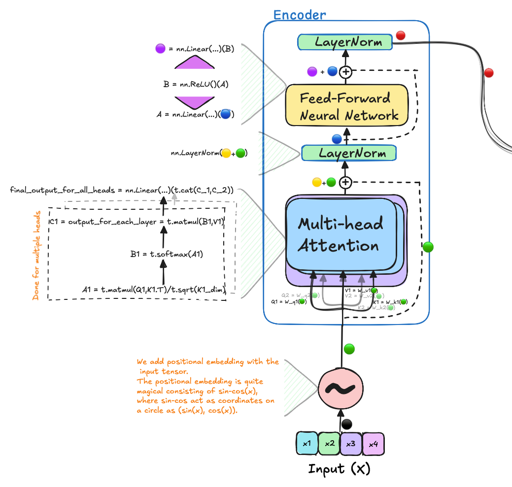
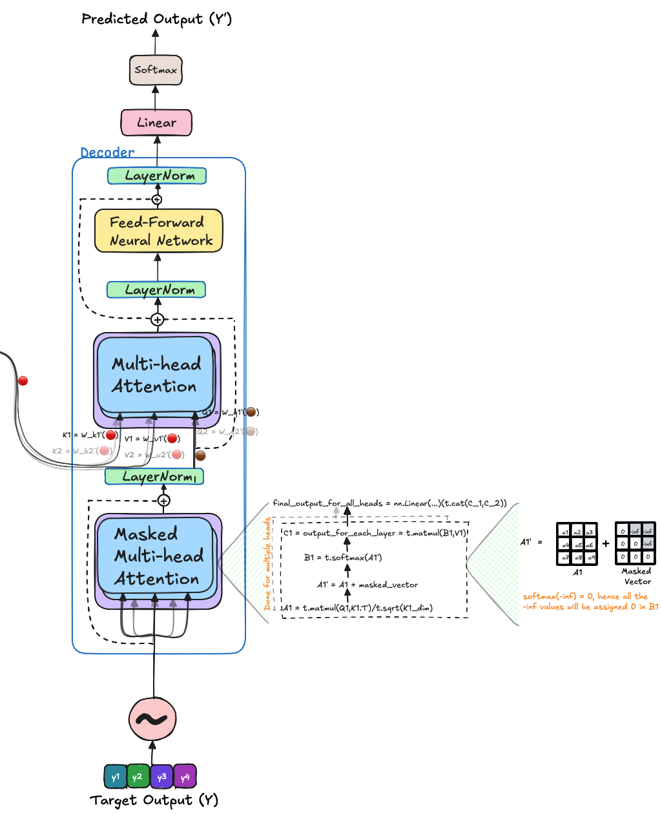

# 🤖🗒️ Transformer From Scratch:

**Give it a star 🌟 if you like the repo 😄.**

I will be implementing a 1 layer Transformer architecure with with no dropouts, custom optimisation and layers.
The implementation is built by taking the [official reserch paper](https://arxiv.org/abs/1706.03762) as basis.
This repo will be aimed to provide insights to me and to other how really Transformers work, even at gradients level.
This will not only enable the users to build upon this repo but will also be able to do toy experiments; as we all are GPU poor 😛. 
Some of the ideas that could be tried is inquiring how tranformers learn and generalize?
Furthermore, different experiments such as grokking for very simple experiments like prediting addition or other operation on numbers.
This could also be used by others better understand Transformer.

I would be excited to post open questions and their answers that i would encounter during this implementation (some of them posted below).
I hope it would be useful resource for the community.

I am constantly active on Twitter and can be found posting useful things i find during my learning journey: [Twitter](https://x.com/ChaudharyMaheep)


*[It is advicable to view the figure on a big screen if not, then to be zoomed out, to know the nitty-gritties of the figure.]*


## 🧿 Positional Encoding:

- We will require the position embedding to be unique for each word in the sentence. As it represents different position and having the same position will affect the learning of the model. Hence, we will need to create a bits and bytes type of representation for each word in the sentence. The LSB bit is alternating on every number, the second-lowest bit is rotating on every two numbers, and so on. However, using binary values would be inefficient in a world dominated by floating-point numbers. Instead, we can represent them with their continuous float equivalents—sinusoidal functions. These functions essentially act like alternating bits.

```python
    def position_embedding(self, sent: Tensor, d_model: int) -> Tensor:

        pe = np.zeros((sent.size()[0], d_model))

        for pos, word in enumerate(sent.size()[0]):
            for i in range(0,d_model, 2):
                pe[pos][i] = math.sin(pos/(10000**(2*i/d_model)))
                pe[pos][i+1] = math.cos(pos/(10000**(2*i/d_model)))

        # adding positional encoding to the sentence, that will be passed into the transformer (encoder/decoder).
        final_sent = sent + pe
        return t.tensor(final_sent)

```


<p align="center"><em>Figure 2 - The 128-dimensional positonal encoding for a sentence with the maximum lenght of 50. Each row represents the embedding vector [<a href = "https://kazemnejad.com/blog/transformer_architecture_positional_encoding/">1</a>].</em></p>

<!-- please write about this image also -->

### 🙋🏻‍♂️ Open Questions:

1. Is there any better positional encoding method?
2. How much does this positional encoding affect the model and overall generalization?


## Encoder:

* How can we think about the relevance of "key", "value" and "query"?

I have explained individual modules of encoder below, including:

1. Multi-Head Attention
2. LayerNorm
3. Feed-Forward Layers




### Multi-Head Attention:


```python
   def self_attention(self):

        query = self.W_q(self.input_embedding).view(1, self.num_heads, self.seq_len, self.q_dim) # (1, 2, 4, 512)
        key = self.W_k(self.input_embedding).view(1, self.num_heads, self.seq_len, self.k_dim) # (1, 2, 4, 512)
        value = self.W_v(self.input_embedding).view(1, self.num_heads, self.seq_len, self.v_dim) # (1, 2, 4, 512)
        
        # we will take the dot product of query and key to get the similarity score.
        attention_score = t.softmax(t.matmul(query, key.transpose(2,3))/t.sqrt(t.tensor(self.k_dim)), dim=-1) # (1, 2, 4, 4)
        overall_attention = t.matmul(attention_score, value)

        overall_attention = t.cat(overall_attention).view(1, self.seq_len, self.k_dim*self.num_heads) # (1, 4, 512)
        
        final_attention = self.W_o(overall_attention) # (1, 4, 512)
                
        return final_attention

```

### LayerNorm:


<center><i>Figure 2: Layer Normalisation happens between same set of features of different samples [<a href = "https://www.pinecone.io/learn/batch-layer-normalization/">2</a>].</i></center>

```python
self.layer_norm = nn.LayerNorm(512)
```

### Feed-Forward Layers:


```python
    def ffn(self, x:Tensor) -> Tensor:
        x1 = self.fc1(x)
        x2 = self.relu(x1)
        x3 = self.fc2(x2)
    
        return x3
```

This is the whole code of Encoder: 

```python
class encoder:

    def __init__(
        self,
        num_heads: int,
        sent: Tensor) -> None:
        
        super(encoder, self).__init__()
        
        self.sent = sent
        self.num_heads = num_heads
        self.k_dim = 512; self.v_dim = 512; self.q_dim = 512
        self.W_q = nn.Linear(512, self.k_dim*self.num_heads) 
        self.W_k = nn.Linear(512, self.k_dim*self.num_heads)
        self.W_v = nn.Linear(512, self.v_dim*self.num_heads)

        self.seq_len = sent.size()[0]
        assert self.seq_len == 4, "The sequence length should be 4."
        
        self.W_o = nn.Linear(512*self.num_heads,512) 
        
        self.layer_norm = nn.LayerNorm(512)
        
        self.fc1 = nn.Linear(512, 1024)
        self.fc2 = nn.Linear(1024, 512)
        self.relu = nn.ReLU()

    # we will make two heads for multi-head attention
    def self_attention(self):

        query = self.W_q(self.input_embedding).view(1, self.num_heads, self.seq_len, self.q_dim) # (1, 2, 4, 512)
        key = self.W_k(self.input_embedding).view(1, self.num_heads, self.seq_len, self.k_dim) # (1, 2, 4, 512)
        value = self.W_v(self.input_embedding).view(1, self.num_heads, self.seq_len, self.v_dim) # (1, 2, 4, 512)
        
        # we will take the dot product of query and key to get the similarity score.
        attention_score = t.softmax(t.matmul(query, key.transpose(2,3))/t.sqrt(t.tensor(self.k_dim)), dim=-1) # (1, 2, 4, 4)
        overall_attention = t.matmul(attention_score, value)

        overall_attention = t.cat(overall_attention).view(1, self.seq_len, self.k_dim*self.num_heads) # (1, 4, 512)
        
        final_attention = self.W_o(overall_attention) # (1, 4, 512)
                
        return final_attention
        

    def ffn(self, x:Tensor) -> Tensor:
        x1 = self.fc1(x)
        x2 = self.relu(x1)
        x3 = self.fc2(x2)
    
        return x3

    def forward(self):
        self.input_embedding = self.position_embedding(self.sent, 4)
        multi_head_attn = self.self_attention()
        multi_head_attn_out = self.W_o(multi_head_attn) #(4,2048) * (2048, 4) = (4, 4)
        input_embedding = self.layer_norm(multi_head_attn_out + self.input_embedding)
        ffn_out = self.ffn(input_embedding)
        encoder_out = self.layer_norm(ffn_out + input_embedding)
        return encoder_out
```


## Decoder



### Multi-Head Attention


```python
    def multi_head_attention(self, encoder_output: Tensor, dec_attn: Tensor) -> Tensor:
        '''
        We are making this function for just 1 sample. 
        The words of which will be computed to have similarity with each other.

        The query, key, and value are the three vectors that are used to computed with the embedding layer dim to assign a new dim.
        '''

        query = self.W_q(dec_attn).view(1, self.num_heads, self.seq_len, self.q_dim)
        key = self.W_k(encoder_output).view(1, self.num_heads, self.seq_len, self.k_dim)
        value = self.W_v(encoder_output).view(1, self.num_heads, self.seq_len, self.v_dim)

        attention_score = t.matmul(query, key.transpose(2,3))/t.sqrt(t.tensor(self.k_dim))
        # Adding the attention score with the masking tensor to mask the future words in the sentence.
        attention_score = t.softmax((attention_score + self.masking_tensor), dim = -1)
        
        overall_attention = t.matmul(attention_score, value)
        overall_attention = t.cat(overall_attention).view(1, self.seq_len, self.k_dim*self.num_heads)
        final_attention = self.W_o_m(overall_attention)
        
        return final_attention 
```

### Masked Mutli-Head Attention


```python
    def masked_multi_head_attention(self, encoder_output: Tensor, dec_attn: Tensor) -> Tensor:
        '''
        We are making this as the masked multi-head attention, as we are masking the future words in the sentence.
        For reference you can look at its diagram before implementation to get an intuition about it.  
        ''' 
        query = self.W_q_m(dec_attn).view(1, self.num_heads, self.seq_len, self.q_dim)
        key = self.W_k_v_m(encoder_output).view(1, self.num_heads, self.seq_len, self.k_dim)
        value = self.W_k_v_m(encoder_output).view(1, self.num_heads, self.seq_len, self.v_dim)

        attention_score = t.matmul(query, key.transpose(2,3))/t.sqrt(t.tensor(self.k_dim))
        # Adding the attention score with the masking tensor to mask the future words in the sentence.
        attention_score = t.softmax((attention_score + self.masking_tensor), dim = -1)
        
        overall_attention = t.matmul(attention_score, value)
        overall_attention = t.cat(overall_attention).view(1, self.seq_len, self.k_dim*self.num_heads)
        final_attention = self.W_o_m(overall_attention)
        
        return final_attention 
```

This is one of the least explained architecture in the related materials and the connection between decoder and encoder is not much explained. 
However, we will try to be transparent to showcase how weights move. 

## Exercise to understand Architecture in Depth.

- TBW

## 🎀🙇🏻 Acknowledgements:

- [Transformer Architecture: The Positional Encoding by Amirhossein Kazemnejad's](https://kazemnejad.com/blog/transformer_architecture_positional_encoding/)
- [What is Masked multi-head attention?](https://stackoverflow.com/questions/58127059/how-to-understand-masked-multi-head-attention-in-transformer)
- [Transformer Neural Network explained by CodeEmporium](https://youtu.be/TQQlZhbC5ps?si=sf5I8zt-reSg7dqI)
- [Transformer Playslist by CodeEmporium](https://www.youtube.com/playlist?list=PLTl9hO2Oobd97qfWC40gOSU8C0iu0m2l4)
- [The Illustrated Transformer by Jay Alammar](https://jalammar.github.io/illustrated-transformer/)


Connect with me or to have an e-coffee 😉 on [Twitter](https://x.com/ChaudharyMaheep) 

